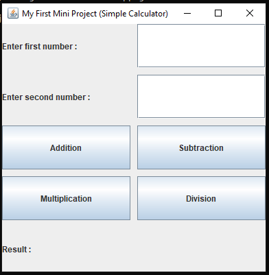

# Java-Swing-Calculator
A simple calculator application built using Java Swing and GridLayout.

## Features
- Addition
- Subtraction
- Multiplication
- Division
- Error Handling
- GridLayout GUI

## Technologies Used
- Java
- Swing
- GridLayout

## Files
- CalculatorApp.java
- README.md
- calculator.png
  
## Screenshot

## Author
Hammad
